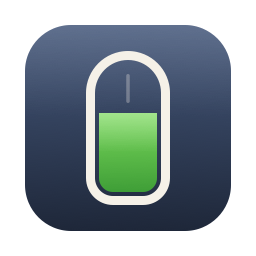
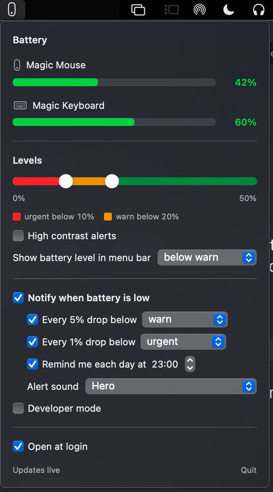

# magicbar

**A free app that warns you before your Magic Mouse or Magic Keyboard runs out of battery.**

macOS does warn you — but only at 6%, when it is already too late to plan around. That hurts
most with a Magic Mouse: it charges through a port on the bottom, so you cannot use it while it
charges.

magicbar lives in your menu bar and speaks up earlier, while you can still pick a good moment
to plug in.

## What you'll see

  

**When everything is fine** — a small mouse icon in your menu bar, and nothing else. Click it
to see the battery level of every device.

**When a battery gets low (below 20%)** — the icon changes to show *that* device, with a
battery bar and its percentage, in **orange**. You get a notification every time it drops
another 5%.

**When it is really low (below 10%)** — the icon turns **red**, and you get a notification for
every 1% it drops. That is on purpose: at this point you want to be bothered.

**Once a day** — an optional reminder at a time you choose (6 pm unless you change it), if
something needs charging.

If two devices are low at once, the menu bar shows the lower one. While something is charging
and nothing else is low, the menu bar shows it filling up.

It works with Apple mice and keyboards automatically — there is nothing to set up. It has been
tested with a Magic Mouse and a Magic Keyboard. A Magic Trackpad should work too, but nobody has
tried one yet.

## Install

You need a Mac running **macOS 14 Sonoma or later**.

1. Download **magicbar.zip** from the [Releases page](https://github.com/dominic-lam/magicbar/releases).
2. Open the zip file, then drag **magicbar** into your **Applications** folder.
3. Open magicbar. macOS will say it cannot be opened. **This is expected** — see below.
4. Open **System Settings › Privacy & Security**, scroll to the bottom, and click
   **Open Anyway** next to magicbar. Confirm when asked.
5. When magicbar asks to send notifications, click **Allow**.

That's it. magicbar starts by itself every time you log in, and you never repeat steps 3 and 4.

### Updating

When a new version is out, the bottom of magicbar's window says **Version … available**. Click
it to open the download page, then repeat steps 1 and 2, replacing the old copy. If macOS blocks
the new version, repeat step 4 as well.

### Why macOS blocks it the first time

Apple only waves an app straight through if its developer pays for a yearly Apple Developer
membership. magicbar is a free side project with no income, so it doesn't have one. The app is
not broken and not dangerous — macOS simply hasn't been told who made it. All of its code is
public on this page for anyone to read.

## Changing the settings

Click the menu bar icon to open magicbar. From there you can:

- **Move the two warning levels** with the slider — orange ("warn") and red ("urgent").
- **Choose when the battery shows in the menu bar** — only below the orange level, only below
  the red level, or always.
- **Choose which notifications you get** — every 5%, every 1%, the daily reminder, and the sound.
- **Turn on high contrast alerts** if the orange and red are hard to tell apart.
- **Click "Check now"** to look for a new version straight away.
- **Turn off "Open at login" or "Check for updates"**, or quit the app.

Changes apply straight away.

## Privacy

No account, no analytics, no tracking. magicbar reads your devices' battery levels, and the
only thing it ever does online is check for updates.

Once a day, it asks GitHub whether a newer version exists. Nothing about you or your devices is
sent — GitHub only sees that a request came in, as any website would. Nothing is ever
downloaded or installed on its own. Untick **Check for updates** and magicbar never goes online
at all.

## Something not working?

**No notifications**
Open **System Settings › Notifications › magicbar** and turn on **Allow Notifications**. If
magicbar's window shows an orange box saying notifications are blocked, its button takes you
straight there.
Tip: choose **Alerts** instead of **Banners** if you want the warning to stay on screen until
you dismiss it.

**The icon isn't in the menu bar**
Open magicbar again from your Applications folder. If it still doesn't appear, your menu bar is
probably full — on a MacBook, icons that don't fit beside the camera notch are hidden without
warning. Quitting another menu bar app makes room.

**A device is missing**
magicbar can only read a device while it is connected. A mouse or keyboard that is switched off
or has gone to sleep drops out of the list until it reconnects — click the mouse or press a key.
If its battery was already low, magicbar keeps showing its last reading, marked "last seen", so
a low device can't quietly vanish.

**It doesn't start when I log in**
Open magicbar, turn **Open at login** off and on again. You can also check
**System Settings › General › Login Items**.

**Still stuck?** [Open an issue](https://github.com/dominic-lam/magicbar/issues) and describe
what you see.

## Uninstall

Click the menu bar icon, click **Quit**, then drag **magicbar** from Applications to the Trash.
If it is still listed under **System Settings › General › Login Items**, remove it there.

## For developers

Building from source, diagnostics and how the app reads battery levels are in
[docs/DEVELOPMENT.md](docs/DEVELOPMENT.md).

## License

Free and open source under the [MIT license](LICENSE) — Dominic Lam, 2026.
